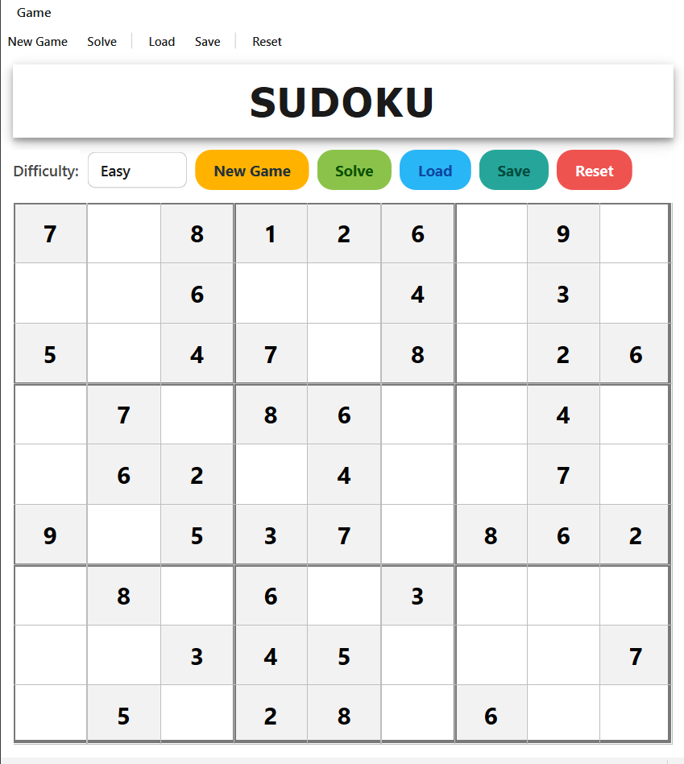
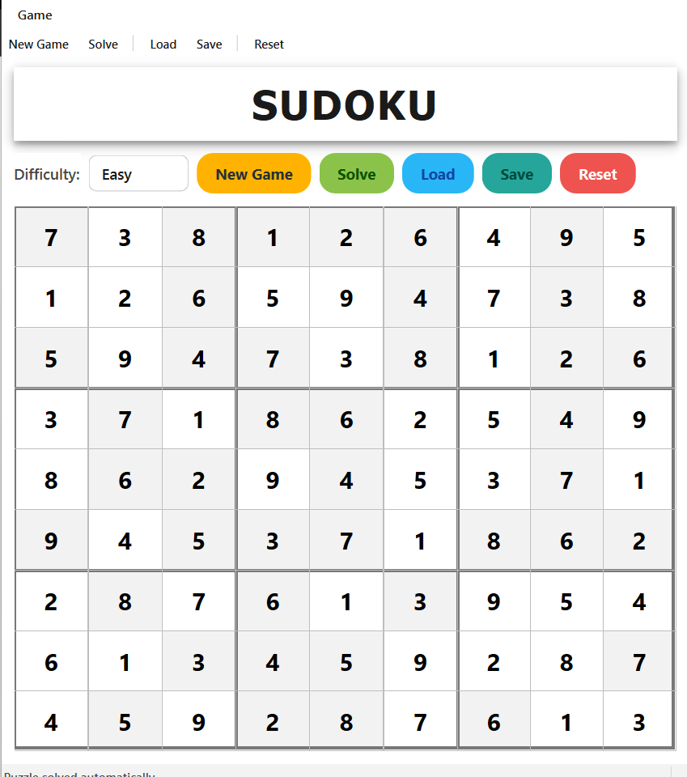

# Sudoku-Game 🎲

<div align="center">
  


  
</div>

**C++ Sudoku Game** with a **Qt desktop interface** built on top of a reusable puzzle engine. The application allows users to generate new Sudoku boards, load saved games, make moves with **real-time validation**, and delegate difficult puzzles to an integrated solver.

## Highlights
- **Qt GUI** – Difficulty picker, action buttons, bold 3×3 block borders, and status feedback in a clean white layout.
- **Puzzle generation** – Create Easy, Medium, or Hard puzzles on demand using the bundled generator.
- **Live validation** – Prevents illegal moves, enforces number ranges, and resets protected clues automatically.
- **Solver integration** – One click delegates the current board to the backtracking solver.
- **Load & save** – Restore puzzles from `Games/` samples (or your own files) and export progress at any time.


## Screenshots
| Main Window | Puzzle solved automatically |
|------------|---------------------|
|  |  |

## Project Structure
```
SudokuGame/
├── README.md
├── IO_Samples.md              # Example console I/O transcripts
├── Makefile                   # Qt build script
├── Include/
│   ├── SudokuBoard.hpp
│   ├── SudokuException.hpp
│   ├── SudokuGame.hpp
│   ├── SudokuGenerator.hpp
│   └── SudokuSolver.hpp
├── Src/
│   ├── main.cpp
│   ├── SudokuBoard.cpp
│   ├── SudokuException.cpp
│   ├── SudokuGame.cpp
│   ├── SudokuGenerator.cpp
│   ├── SudokuSolver.cpp
│   └── UserInterface.cpp      # Qt main window implementation
├── Games/                     # Sample Sudoku boards (text files)
└── Images/                    # Pictures of the UI                             
```


## Build & Run
The Makefile expects a Qt 6 installation. Point `QT_ROOT` at the Qt kit you want to use (the path that contains `bin`, `lib`, and `include`).

```bash
make QT_ROOT="..Qt/6.10.1/mingw_64" build
make QT_ROOT="..Qt/6.10.1/mingw_64" run
```

## Requirements
- C++17-compatible compiler (Qt 6 requires C++17)
- Qt 6 Widgets module (headers + libraries)
- GNU Make 4.x
- CMake 3.16+ (bundled with Qt; used indirectly by the Makefile) 
